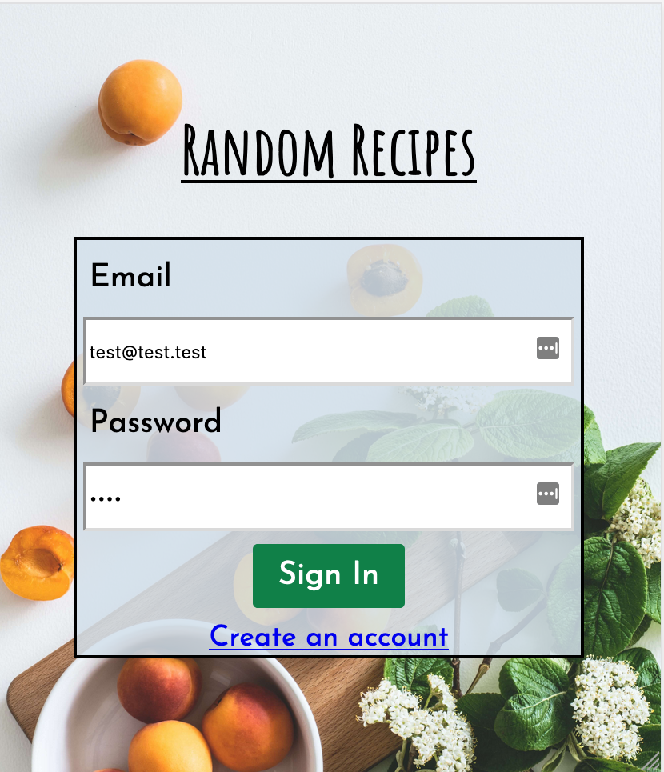
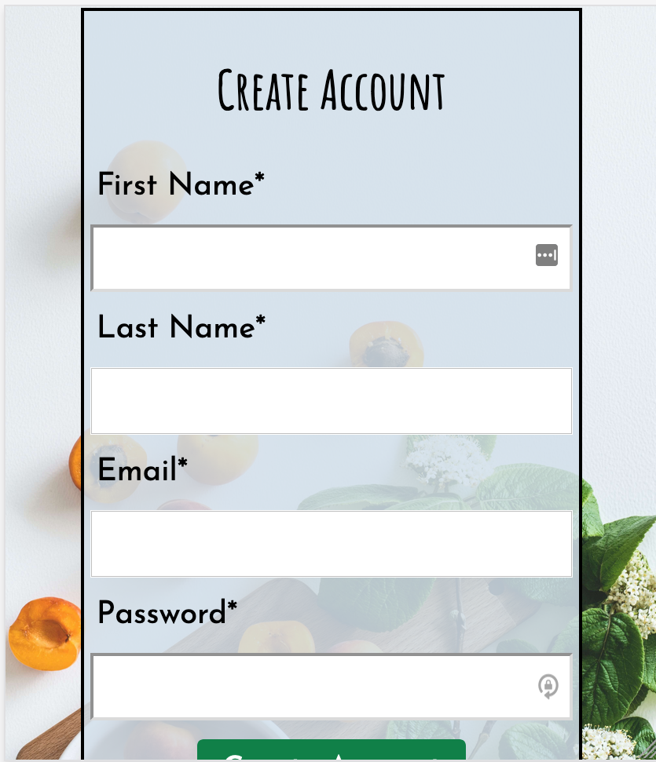
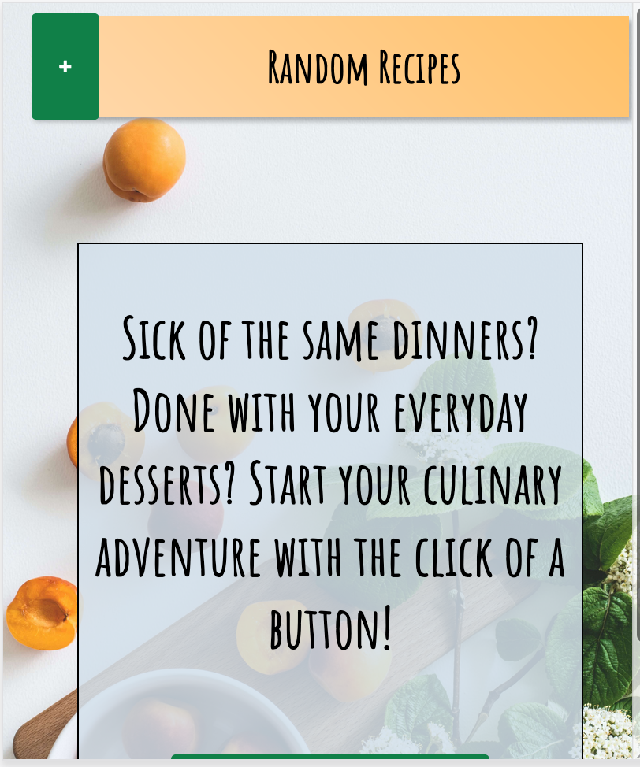
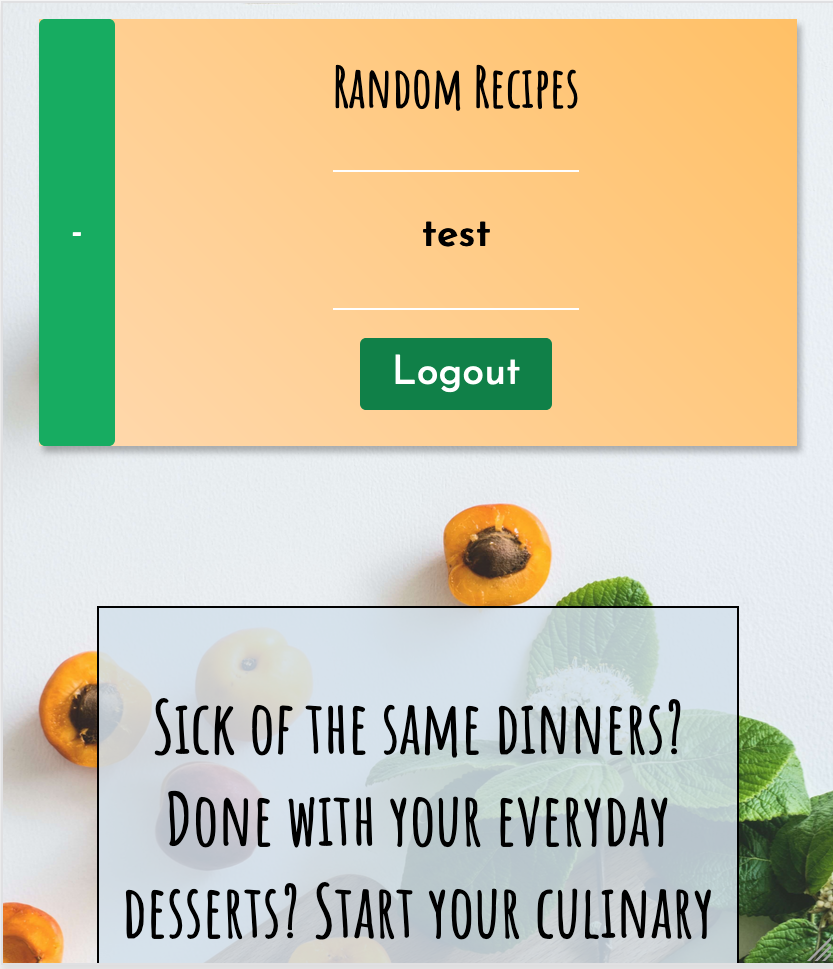
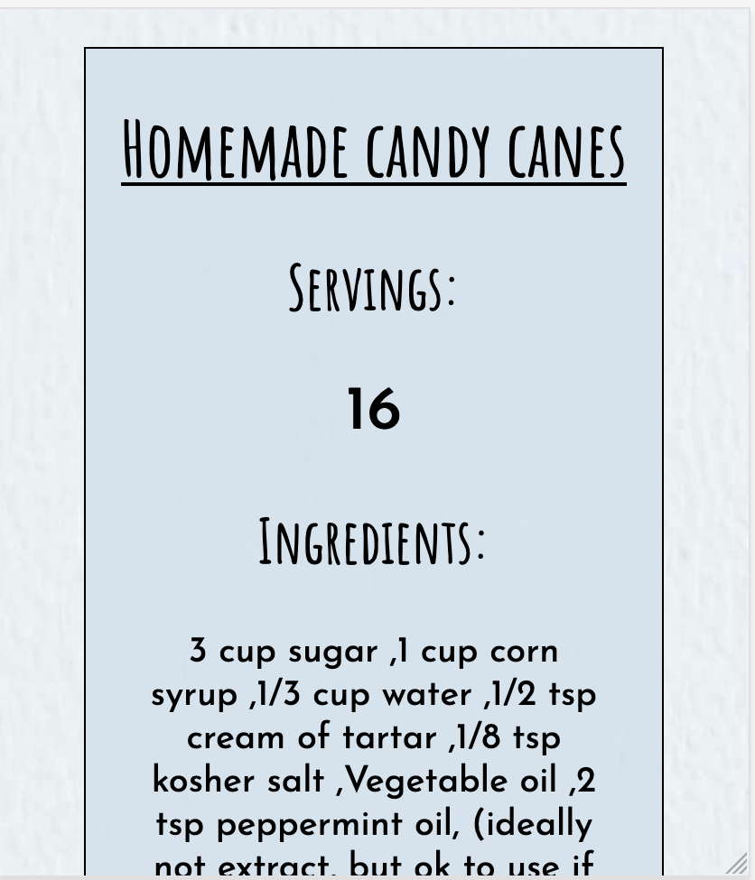

<h1>Random Recipe Roulette</h1>

Provides users with a new random recipe

<h2>Live Link:</h2>

https://random-recipe-roulette.jonretchless.vercel.app

<h2>Demo Credentials:</h2>
<ul>
    <li>Email: test@test.test</li>
    <li>Password: test</li>
    <li>Email: test2@test.test</li>
    <li>Password: test</li>
</ul>
<h2>Screenshots:</h2>
<ul>
    <li>
        Login
         
        
    </li>
    <li>
        Signup
         
        
    </li>
    <li>
        Homepage
         
        
    </li>
    <li>
        Homepage Menu
         
        
    </li>
    <li>
        New Recipe
         
        
    </li>
</ul>
 
 
<h2>Tech Used:</h2>
<ul>
    <li>React</li>
    <li>JS</li>
    <li>Node</li>
    <li>Express</li>
    <li>PostgreSQL</li>
</ul>
 
 
<h2>API Documentation:</h2>
<ul>
    "/api/users/"
    <li>
        POST: add new user
    </li>
</ul>
<ul>    
    "/api/users/:user_id"
    <li>
        GET: return user
    </li>
    <li>
        DELETE: delete user
    </li>
    <li>
        PATCH: update user information
    </li>
</ul>
<ul>
    "/api/login"
    <li>
        POST: add user to session auth
    </li>
</ul>
<ul>
    "api/logout"
    <li>
        GET: set session user to null
    </li>
</ul>
<ul>
    "/api/recipes"
    <li>
        GET: return all recipes
    </li>
</ul>
<ul>
    "/api/recipes/names"
    <li>
        GET: return all recipe names (effective check for recipes array length)
    </li>
</ul>
<ul>
    "/api/recipes/random/:recipe_id"
    <li>
        GET: return 1 random recipe
    </li>
</ul>
